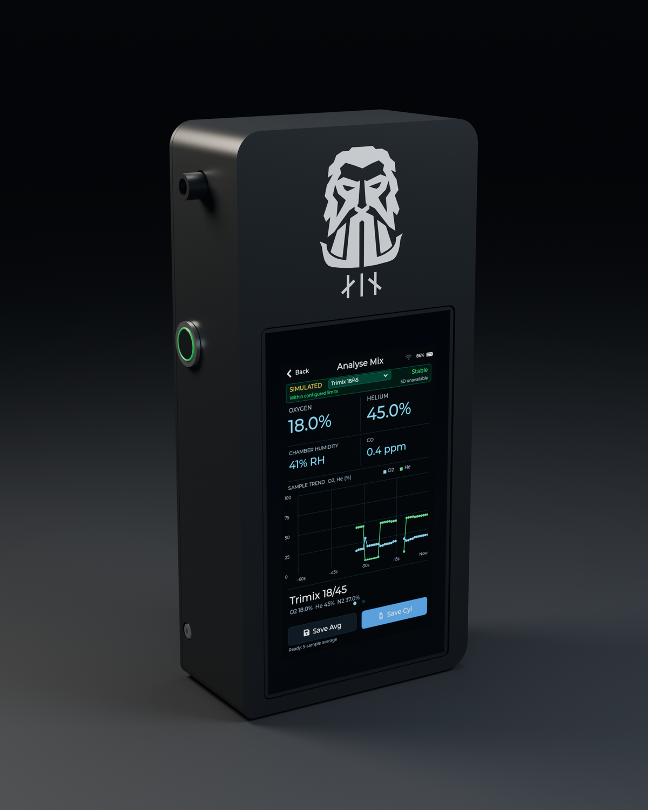
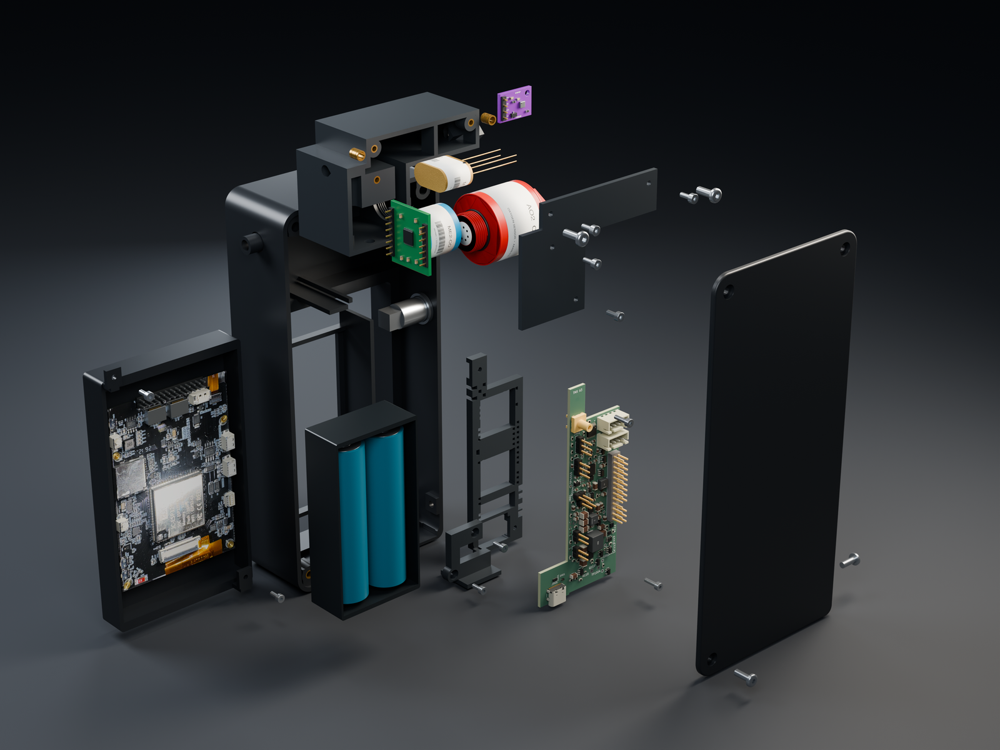

Ægir is a work-in-progress trimix gas analyzer for technical diving. It is not
qualified as a breathing-gas safety instrument; use it at your own risk.

Made in Norway 🇳🇴.

## The name

In Norse mythology, Ægir (/ˈæːɣir/) is the giant who rules the sea. He is
known for hosting the gods in his halls adorned with gold and, together with
Rán, is the father of nine daughters who personify the waves.

The runes ᛅᛁᚾ are a Viking Age-style representation of einn, Old Norse for
“one”, marking the first version of the project: Ægir 1.

## Features

- Oxygen (O₂) and helium (He) sensor inputs, plus CO monitoring
- 4.3-inch touch screen for gas analysis, calibration and settings
- Mix calculations, dive planning and analysis history
- Desktop simulator with demo readings

**[Try the interactive browser demo](https://magnus188.github.io/aegir/).**

## Device design



*CAD-based render of the current prototype.*




## Screenshots

These screens show the simulator with demo data.

| Main menu | Live analysis | Analysis details |
| :---: | :---: | :---: |
|  |  |  |

| History | Cylinders | Settings |
| :---: | :---: | :---: |
|  |  |  |

| Dive Planner | Device Settings |
| :---: | :---: |
|  |  |

| Simulated high CO alert | Safety Settings |
| :---: | :---: |
|  |  |

## Run it

For the desktop simulator, install a C++ compiler, CMake, `pkg-config` and SDL2,
then run from the repository root:

```sh
make sim-deps
make sim ZOOM=0.75
```

Run the host tests with `make test`.

To build and flash the firmware on the Guition JC4880P443C_I_W ESP32-P4 board,
install Python 3.13 and run:

```sh
make setup-idf
make devices
make board-info PORT=/dev/cu.usbserial-110
make push PORT=/dev/cu.usbserial-110
```

Replace the example `PORT` with the port reported by `make devices`. See the
[firmware guide](software/firmware/README.md) for other build options.

## Contributing and future ideas

Design reviews, measurements, documentation and software fixes are welcome.
Start with the [contribution guide](CONTRIBUTING.md) and
[open issues](https://github.com/magnus188/aegir/issues). The
[v2 investigation backlog](https://github.com/magnus188/aegir/milestone/1)
collects community suggestions without promising a release date.

Maintainers can use the [repository guide](.github/MAINTAINING.md). For
exploitable vulnerabilities, use the [private reporting route](SECURITY.md).

## Acknowledgements

A big thank you to [@tobiasruber](https://github.com/tobiasruber) for reviewing and
improving the PCB design. His help is a big reason this project is still alive
and moving forward.

## License

Software: [GPLv3](LICENSES/GPL-3.0-only.txt). PCB and CAD files:
[CERN-OHL-S-2.0](LICENSES/CERN-OHL-S-2.0.txt). The Ægir name and logo have a
separate [brand policy](logo/LICENSE.md). See the [license map](LICENSE.md)
for details and third-party files.
