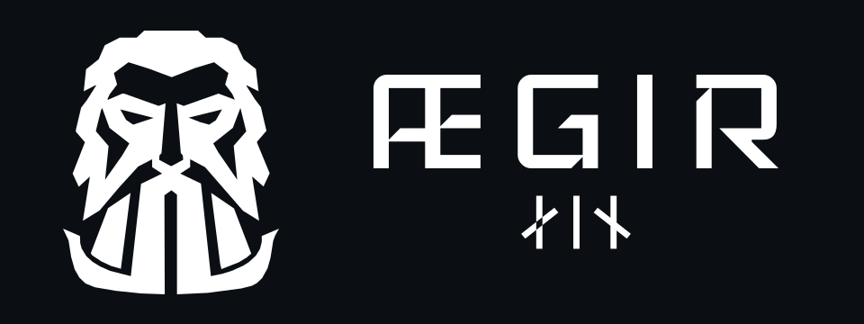

# Ægir 1 identity

The selected mark is the frontal Ægir face whose beard forms a Viking ship's
hull. Earlier logo studies were removed from the working tree; Git history
preserves earlier directions.

| File | Purpose |
| --- | --- |
| [`aegir-mark.svg`](aegir-mark.svg) | Selected one-colour vector mark for scaling and engraving |
| [`aegir-mark.png`](aegir-mark.png) | Original full-resolution raster reference for the selected mark |
| [`aegir-v1-wordmark.svg`](aegir-v1-wordmark.svg) | Outlined **ÆGIR** in Iceland with **ᛅᛁᚾ** as the version-one marker |
| [`aegir-lockup-dark.png`](aegir-lockup-dark.png) | Horizontal, white-on-dark preview for documentation |
| [`aegir-splash.png`](aegir-splash.png) | 480 × 800 preview of the device splash screen |

The logo uses [Iceland](https://github.com/google/fonts/tree/main/ofl/iceland)
with slightly wider letter spacing; the app interface uses the open-source
[Oxanium](../software/firmware/assets/fonts/README.md) typeface. The
wordmark SVG contains vector outlines and renders without the font installed.
Iceland is distributed under the
[SIL Open Font License 1.1](OFL-Iceland.txt).

The Ægir marks and splash artwork are covered by the separate
[brand and trademark policy](LICENSE.md). Project software and hardware remain
open under their own licenses.

The device splash shows the mark, wordmark, and runes in white on the app's
dark background. Its compact LVGL image data and previews can be regenerated
from the selected sources with
[`generate_splash_assets.py`](../software/firmware/scripts/generate_splash_assets.py).

The vector mark is traced from the selected raster artwork. Check its smallest
cutouts at the intended physical size and test the chosen engraving process on
an enclosure sample before production.
