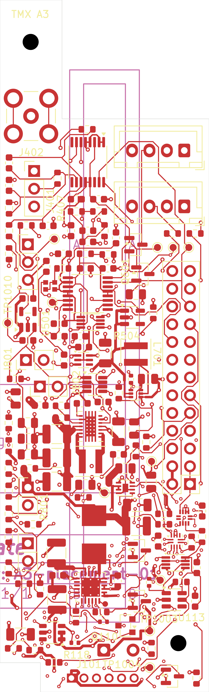
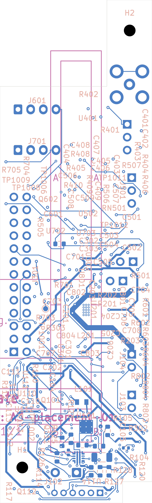
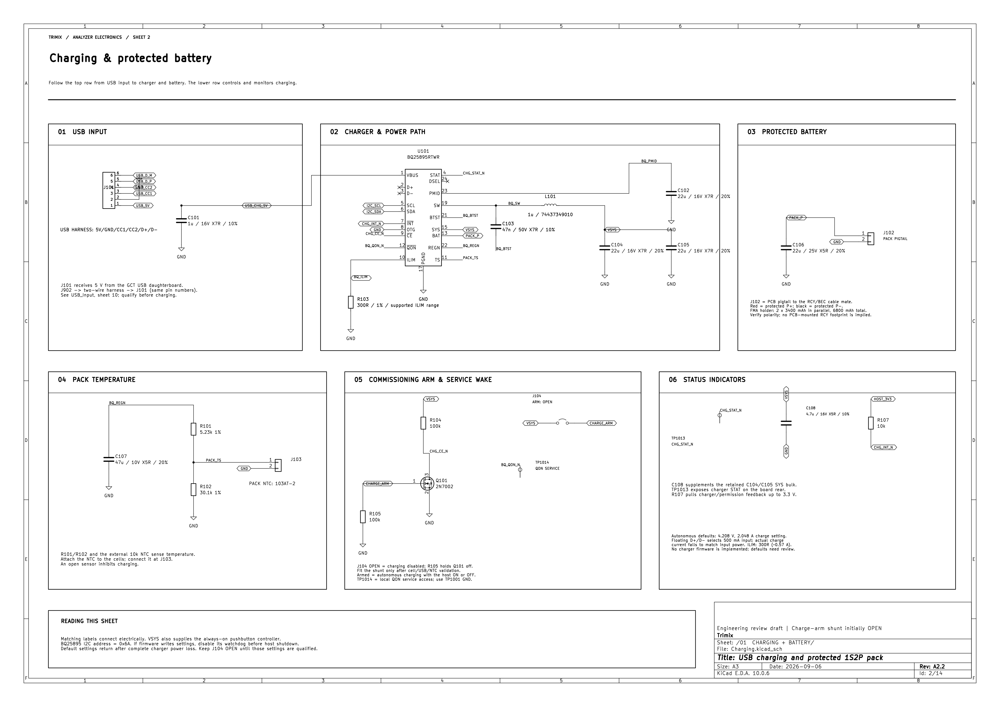
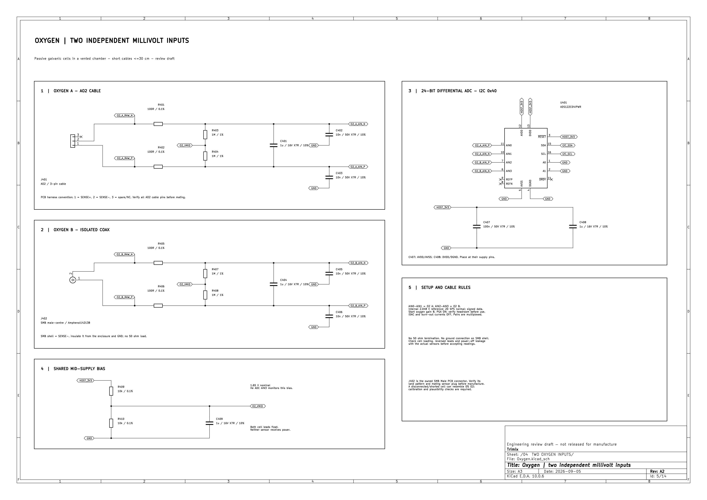
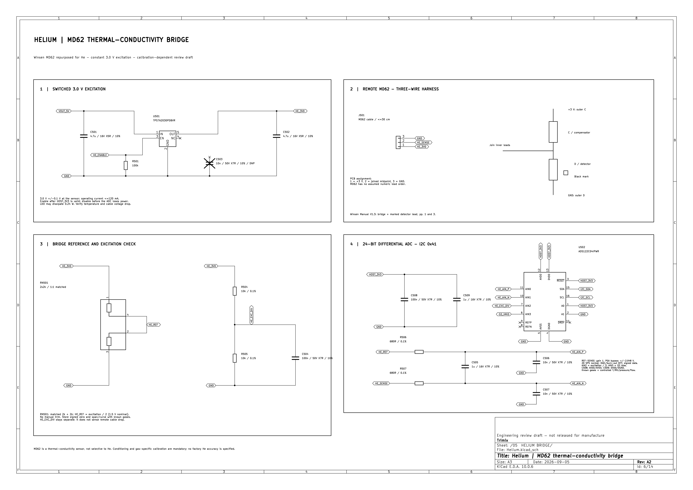
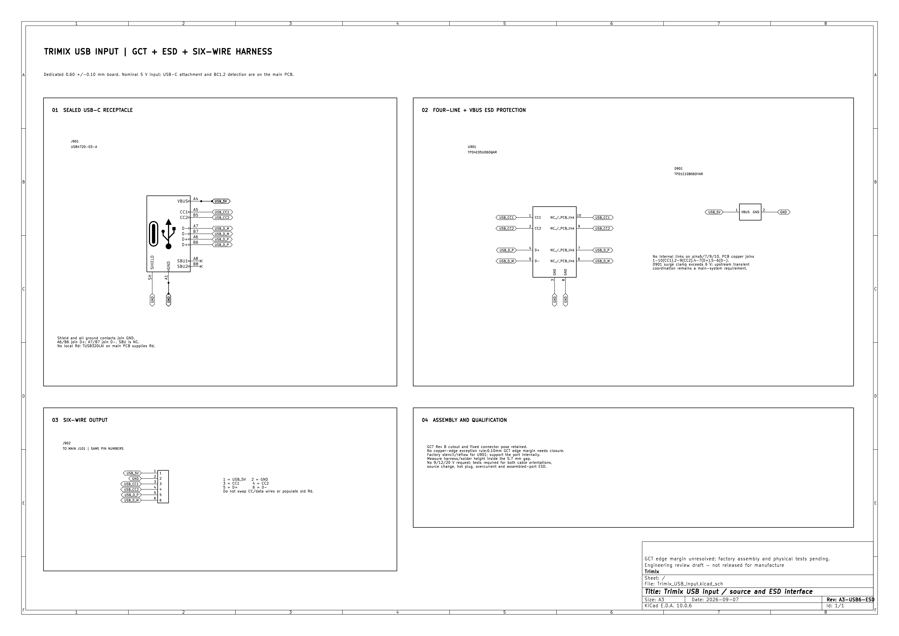
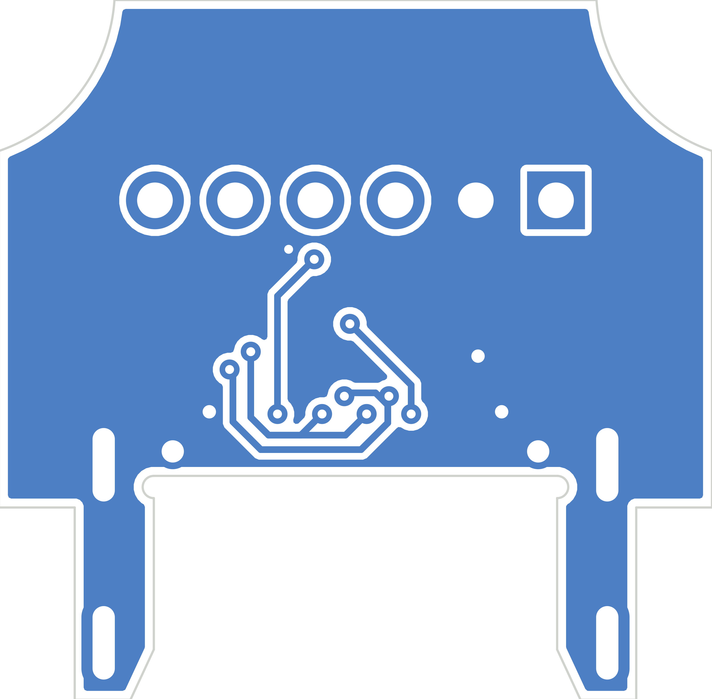

# PCB review images

These KiCad exports show the current [main analyzer PCB](../analyzer/Trimix_Analyzer.kicad_pro)
and separate [USB input PCB](../usb-input/Trimix_USB_Input.kicad_pro) without
requiring KiCad. Click an image to open it at full resolution.

The images were exported on 2026-09-30 from main board SHA-256
`0962ad86f9834ce71b6439d0f95db603753801153490e78f387a88521e582788`
and USB board SHA-256
`63d5742a1f8a2598a80c5d6a962a5551b9bebfa1a59c6780a00ab8ba3dd15ea7`.
The main PCB has four copper layers; the USB board has two. Back-side routing
views are mirrored so they appear as viewed from underneath. The 3D preview
uses available KiCad component models and is not a physical fit check.

**Prototype order status: HOLD.** The [system review](../../system-review/README.md)
records remaining electrical, mechanical and manufacturing work. In particular,
the USB board has unresolved connector copper-to-edge and annular-ring
violations. These images are review aids, not fabrication files.

## Main analyzer PCB

| Component view | Front copper and silkscreen | Back copper and silkscreen |
| :---: | :---: | :---: |
|  |  |  |

### Selected schematic sheets

| Charging and battery | Oxygen inputs | Helium bridge |
| :---: | :---: | :---: |
|  |  |  |

See the [main-board review package](../../system-review/electrical/main-final/README.md)
for the complete schematic, inner copper layers, manufacturing exports and
known limitations.

## USB input PCB

| Schematic | Front copper and silkscreen | Back copper, viewed from underneath |
| :---: | :---: | :---: |
|  |  |  |

See the [USB-board review package](../../system-review/electrical/usb-final/README.md)
for the fabrication holds and source-matched exports.
